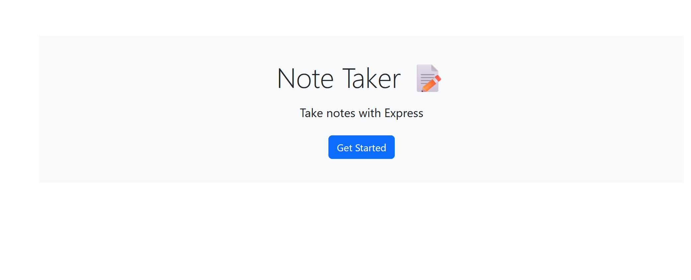
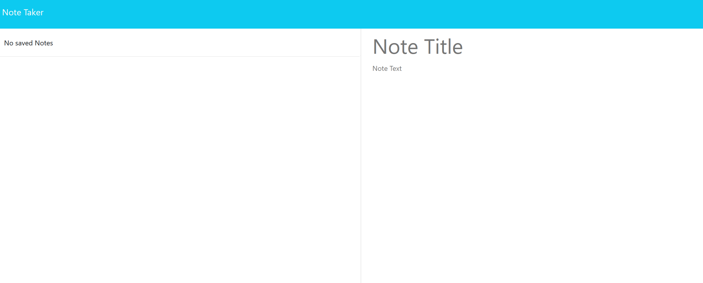
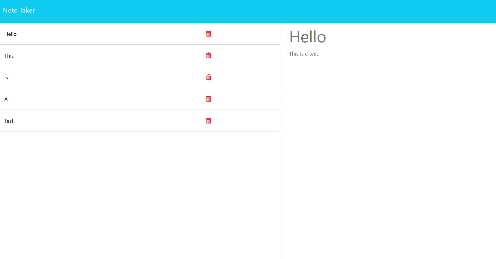

  # 11_Note_Taker

  ## Description

    An Express JS application about taking notes and applying routing principles.

  ## Table of Contents 

  - [Installation](#installation)
  - [Usage](#usage)
  - [Screenshots](#screenshot)
  - [License](#license)

  ## Installation

    Make sure node is installed.
    Run npm install and node server.js in the terminal.

    or

    click the link below to visit the deployed application
[Note Taker](https://one1-note-taker-zplh.onrender.com 'Link title')
    

  ## Usage

    Press the get started button, this will route you to the notes page where you can input a new note. Pressing the trash icon beside will delete
    the corresponding note. Clicking the previous note from the list will display them.

  ## Screenshot
    A screenshot of the index page, press get started to navigate to the note page.

  

    A screenshot of the note page, press the input field to start making notes.

  

    A screenshot of sample notes saved. The trash icon when pressed, will delete the corresponding note.

  

  ## License 
  ### Badge 
  

    
      MIT License

      Copyright (c) function getFullYear() { [native code] } 
      
      Permission is hereby granted, free of charge, to any person obtaining a copy
      of this software and associated documentation files (the "Software"), to deal
      in the Software without restriction, including without limitation the rights
      to use, copy, modify, merge, publish, distribute, sublicense, and/or sell
      copies of the Software, and to permit persons to whom the Software is
      furnished to do so, subject to the following conditions:
      
      The above copyright notice and this permission notice shall be included in all
      copies or substantial portions of the Software.
      
      THE SOFTWARE IS PROVIDED "AS IS", WITHOUT WARRANTY OF ANY KIND, EXPRESS OR
      IMPLIED, INCLUDING BUT NOT LIMITED TO THE WARRANTIES OF MERCHANTABILITY,
      FITNESS FOR A PARTICULAR PURPOSE AND NONINFRINGEMENT. IN NO EVENT SHALL THE
      AUTHORS OR COPYRIGHT HOLDERS BE LIABLE FOR ANY CLAIM, DAMAGES OR OTHER
      LIABILITY, WHETHER IN AN ACTION OF CONTRACT, TORT OR OTHERWISE, ARISING FROM,
      OUT OF OR IN CONNECTION WITH THE SOFTWARE OR THE USE OR OTHER DEALINGS IN THE
      SOFTWARE.
      

  https://choosealicense.com/licenses/mit/
  

  